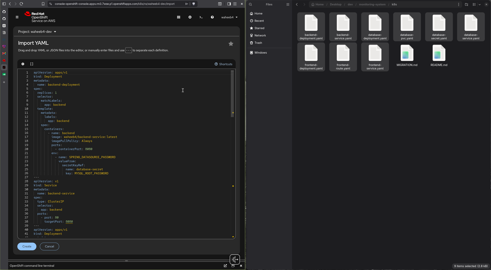
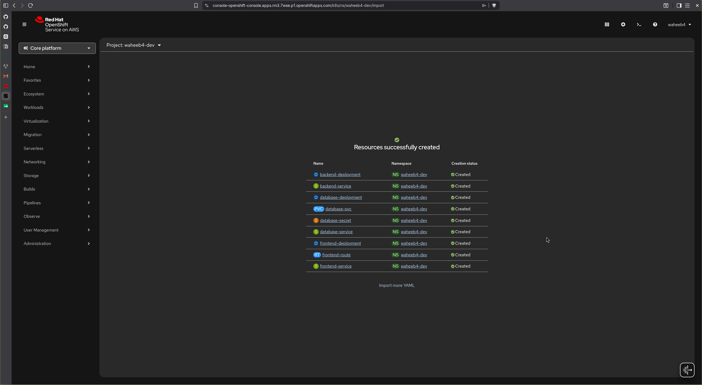

## K8s Cluster

Current setup exposes the Minikube cluster node:30080. Kubernetes forwards traffic to frontend-service:80,
which forwards it to the frontend pod:8080. nginx serves the frontend and forwards API requests to the internal backend
service. Internal communication uses ClusterIP Services, which provide stable DNS names and keep routing correct when Pods are replicated, recreated, or receive new IP addresses.

   Browser
      |
      | Minikube IP : 30080
      v
  frontend-service  (type: NodePort)
      |
      | service port 80 → container port 8080
      v
  frontend Pod (nginx / Angular)
      |
      | internal request to backend-service
      v
  backend-service   (type: ClusterIP)
      |
      | port 80 → container port 8080
      v
  backend Pod (Spring Boot)
      |
      | internal request to database-service
      v
  database-service  (type: ClusterIP)
      |
      | port 3306 → container port 3306
      v
  database Pod (MySQL)

## OpenShift Cluster

Browser will access the app via a domain name, which is owned and configured by OpenShift's sandbox. DNS resolves it to
the OpenShift router. Router will match request hostname the Route which is configured to the desired service. Frontend service is changed from NodePort to ClusterIP as it is no longer the entry point exposed.

   Browser
      |
      | http/https domain : 80/443
      v
  OpenShift Router
      |
      | match request to route
      v
    Route
      |
      | target service: frontend-service:80
      v
  frontend-service  (type: ClusterIP)
      |
      v
  Same cluster

- No exposed :30080 port on every cluster node, users get a normal domain/HTTPS URL instead of a node IP and port.
- The OpenShift Router centrally handles public routing, TLS certificates, redirects, and hostname matching.
- frontend Service keeps a stable internal name (frontend-service) and can still load-balance across multiple frontend Pods.

## Diffs in Manifests

- Change `frontend-service` from `NodePort` to `ClusterIP` and remove `nodePort: 30080`.
- Create a Route that targets `frontend-service`.
- Change frontend nginx upstream addresses because frontend and backend run in the same OpenShift Project/namespace.
- Remove MiniKube specific DNS-server IP from nginx.
- Two separate nginx.conf files, one for local docker compose setup that uses DockerDNS resolver to find compose servcice
and one for OpenShift.
- Use env variables in the backend deployement to ensure the database service url is coreclty overriden.

## OpenShift Creation

- Use Quick Create and drag and drop the yaml files onto the console.

  

  

- Created a jenkins bot that will be used by jenkins 'oc create serviceaccount jenkins-deployer'.

- Give the bot permission to update deployments 'oc policy add-role-to-user edit \
    system:serviceaccount:waheeb4-dev:jenkins-deployer'.

- Create an access token for the bot to use with a 90 day duration 'oc create token jenkins-deployer --duration=2160h' and
added as a global secret text, in addition to docker hub PAT.

- Get the public OpenShift API link that jenkins will call 'https://api.rm3.7wse.p1.openshiftapps.com:6443' and add it as an
env in jenkins.

## Essential Commands

- oc status -> to identify if the services point to the correct pods.
- oc get pods -> get the current running deployments and replica sets.
- oc rollout status deployment/database-deployment -> check rollout pod status.
- oc rollout restart deployment/backend-deployment -> restart the pod.
- oc get svc -> get services.
- oc get pvc -> get persistent volume claim.
- oc get route -> public url for the app.
- oc get endpoints backend-service -> actual pod IP behind the service.
- oc scale deployment/database-deployment deployment/backend-deployment deployment/frontend-deployment --replicas=1 -n waheeb4-dev
